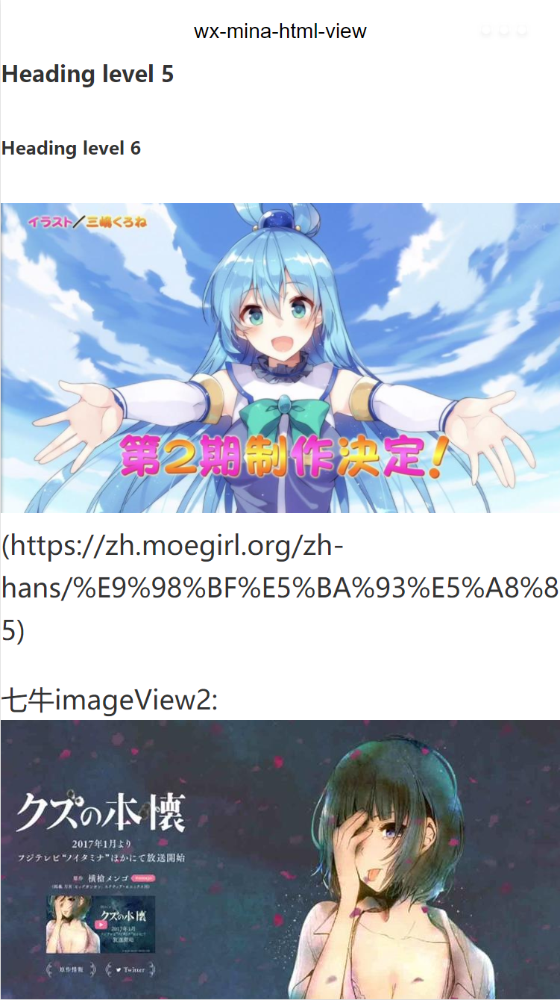

# wx-mina-html-view
微信小程序渲染html



## 支持的特性:
* 大部分的普通HTML标签(未全部测试)
* ``, `<video>`, `<audio>`
* `<table>`, `<tr>`, `<th>`, `<td>`等表格标签
* `<a>`标签转`<navigator>`
* HTML entities
* 七牛图片裁剪
* 自定义插件

不支持`<form>`, `<input>`, `<select>`等表单元素.

## 使用方法
请参考`pages/index`目录里的文件.

### 拷贝`html-view`目录到你的项目.

### 在页面的js/wxml/wxss中, 引入代码:

#### index.js

```js
// 引入HtmlParser
const HtmlParser = require('../../html-view/index')

// ...

// 解析HTML字符串
const html = new HtmlParser('<p>hello world</p>').nodes
this.setData({ html })
```

#### index.wxml

```html
<import src="../../html-view/index.wxml" />

<template is="html-view" data="{{data: html}}" />
```

#### index.wxss

```css
@import "../../html-view/index.wxss";
```

## API

### new HtmlParser(htmlString, { baseUrl })
新建一个HtmlParser实例.

实例化后通过`nodes`属性获取解析后的对象. 数据结构请参看[himalaya](https://github.com/andrejewski/himalaya).

baseUrl: 将`<a>`, ``, `<video>`, `<audio>`, `<source>`引用的相对地址使用`baseUrl`转换为绝对地址.

```js
const html = new HtmlParser('<p>hello world</p>').nodes
```

### htmlParser.each(fn)
递归`nodes`和以下的的每个元素使用`fn`函数处理

`fn`将收到3个参数:
```js
fn(node, index, array)
```

### htmlParser.filter(fn)
递归`nodes`和以下的的每个元素使用`fn`函数过滤. 如果`fn`返回`true`, 则保留该元素, 否则删除该元素. `fn`收到的参数同`htmlParser.each()`

### htmlParser.map(fn)
递归`nodes`和以下的的每个元素使用`fn`函数处理. `fn`需要返回一个新的元素结构, `fn`收到的参数同`htmlParser.each()`


## 内置处理工具

### 图片URL加上七牛imageView2处理
qiniuImg(domain, quality)

``地址的域名如果包含`domain`并且没有query string, 则在后面加上imageView2参数: `?imageView2/2/w/WIDTH/q/QUALITY`.

WIDTH为手机实际像素宽度 (pixelRatio * windowWidth).

QUALITY为传入的`quality`, 如果不传`quality`, 这部分则省略.

```js
const qiniuImg = require('../../html-view/each/qiniuImg')

const html = new HtmlParser(htmlString).each(qiniuImg('qnssl.com')).nodes
```

### `<a>`标签转`<navigator>`
resolveAnchor(domain, routes)

domain: `<a>`指向的URL必须是该domain, 才会执行转换

routes: 将URL的pathname使用routes匹配, 找到匹配的路由则执行转换.

routes的定义请前往[Router](https://github.com/fenivana/Router).

`route.params`和`route.options`会被合并到URL的query string中, 合并/覆盖规则: `Object.assign(route.query, route.params, route.options)`

```js
const resolveAnchor = require('../../html-view/each/resolveAnchor')

const html = new HtmlParser(htmlString).each(resolveAnchor('www.example.com', [
  // ['/pathname/of/url', '/pages/path/of/local/page/index']
  ['/foo', '/pages/foo/index'],
  ['/bar/:id', '/pages/bar/index']
])).nodes
```

## 开发
由于小程序的template不支持递归调用(哈哈什么鬼~), 修改wxml模板请修改`build/template.wxml`文件, 然后执行`npm run build-template`生成`html-view/nodes.wxml`文件

## License
[MIT](LICENSE)
